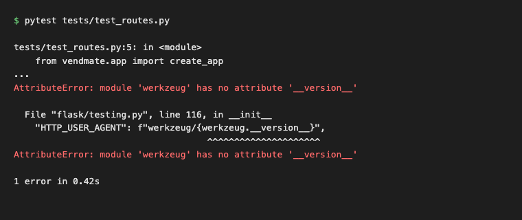
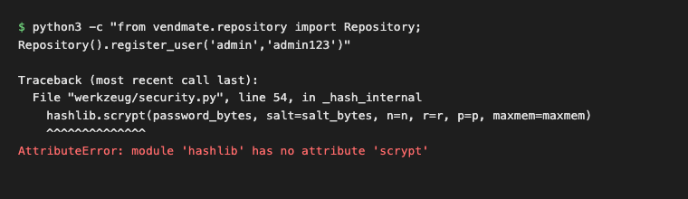
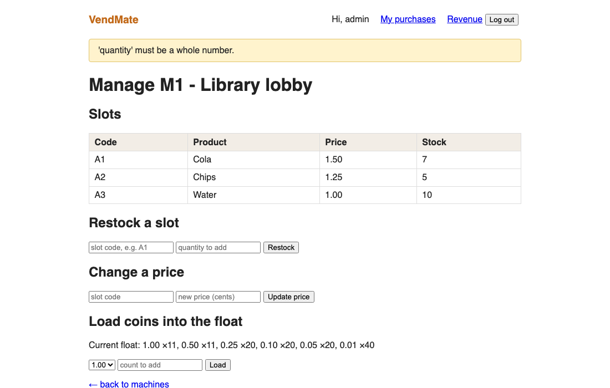

# VendMate - Defect Log

3 bugs found while building and testing this project. All found and
fixed on the same day, while setting up the project and writing the
first batch of tests.

---

## DEF-1: werkzeug version crash

Every single test crashed on the first run with
`AttributeError: module 'werkzeug' has no attribute '__version__'`.

`flask>=2.2` was pinned in requirements, and pip pulled in Werkzeug
3.1.8 as a dependency - but Flask 2.2.5's test client still expects the
old `werkzeug.__version__` attribute, which got removed in Werkzeug 3.x.
Fixed by bumping the pin to `flask>=3.0`.

Severity: Critical (blocked all route tests). Status: Resolved.

## DEF-2: hashlib.scrypt missing

Second bug, hit right after fixing DEF-1: registering a user crashed
with `AttributeError: module 'hashlib' has no attribute 'scrypt'`.

**Root cause:** werkzeug's default password hashing method needs
`hashlib.scrypt`, which isn't available on this Python build.
**Fix:** switched the hashing method to `pbkdf2:sha256` explicitly
instead of relying on werkzeug's default.
**Severity:** Critical - registration and login didn't work at all.
**Status:** Resolved.

## DEF-3: raw Python error shown to the admin

Smaller one, found by clicking through the admin panel rather than from
a failing test. Typing "abc" into a restock quantity field showed the
literal error `invalid literal for int() with base 10: 'abc'` on the
page.

The admin routes were just doing `int(request.form["quantity"])` and
flashing whatever exception message Python gave back. Fixed by adding a
small `_parse_int()` helper in `app.py` that catches the `ValueError`
and shows a proper message instead. There's a regression test for this
one too - TC-18 in `docs/test_cases.md`.

Severity: Medium (nothing breaks, just a bad message). Status: Resolved.

---

**Known limitation, not really a "defect":** everything is in-memory, so
restarting the Flask process wipes all data. No database was added for
this project - the brief didn't require persistence.
